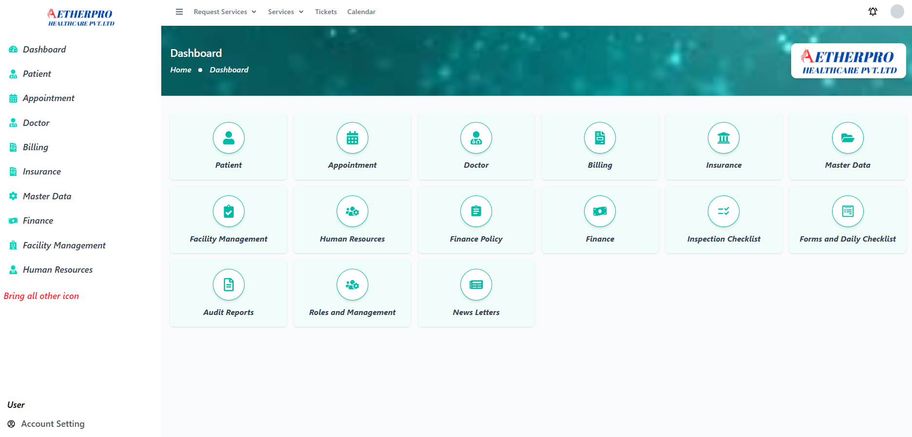
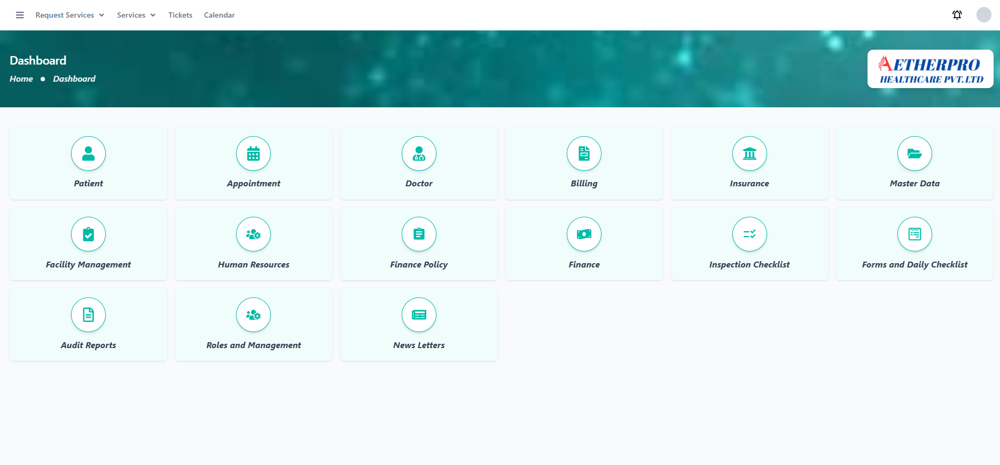
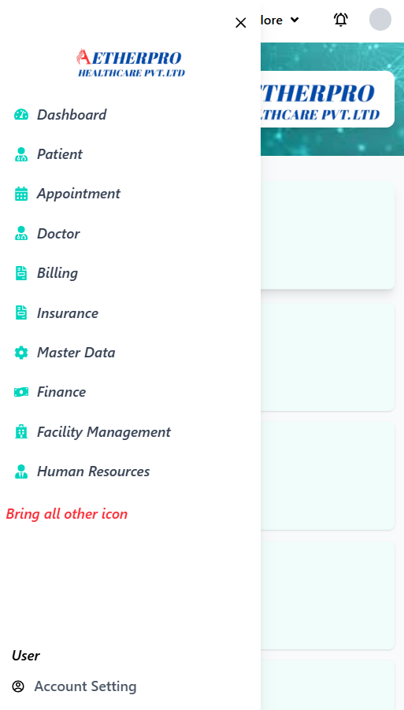

# Hospital Management Dashboard

A hospital management dashboard built with **Next.js**, **TypeScript**, and **Tailwind CSS**.

---

## ⚙️ Installation

1. **Clone the repository**
   ```bash
   git clone https://github.com/moheebk123/Hospital-Dashboard.git
   cd Hospital-Dashboard
   ```

2. **Install dependencies**
   ```bash
   npm i
   or
   npm install
   ```

3. **Run the app**
   ```bash
   npm run dev
   ```

---

## ✨ Screenshots
- **Desktop View With Sidebar Open**

- **Desktop View With Sidebar Closed**

- **Mobile View With Sidebar Open**


- **Mobile View With Sidebar Closed**



---

## 🧑 Author

Developed with ❤️ by **Moheeb Khan**

---